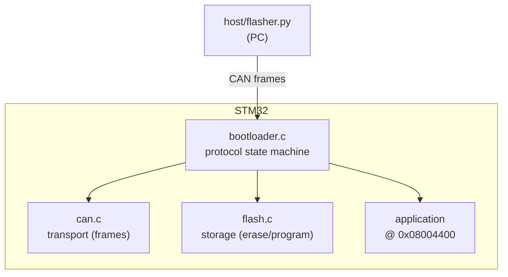
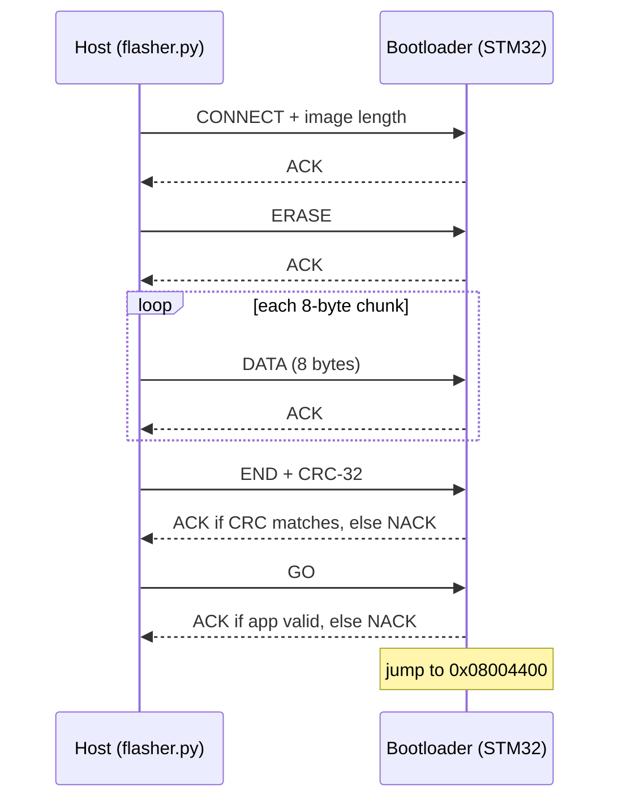

# STM32F103C8T6 CAN Bootloader

I designed a custom CAN bus bootloader for the STM32F103C8T6 ("Blue Pill"),and wrote it in bare-metal — CMSIS and direct register access, no HAL — and I built it from scratch to understand every layer of how a firmware update actually works.

It flashes a new application over a CAN bus, verifies the image with a hardware
CRC-32, refuses to run anything that isn't a valid program, and survives a
power-loss mid-update without bricking the device. A Python host tool drives the
whole exchange from a PC, and a hardware-in-the-loop test suite checks the real
board over CAN.

---

## Contents

- [What it does](#what-it-does)
- [How it was built (the journey)](#how-it-was-built-the-journey)
- [Hardware](#hardware)
- [Flash memory layout](#flash-memory-layout)
- [Architecture](#architecture)
- [The update protocol](#the-update-protocol)
- [Integrity: hardware CRC-32](#integrity-hardware-crc-32)
- [Safety: app validity and anti-brick](#safety-app-validity-and-anti-brick)
- [Repository structure](#repository-structure)
- [Build and flash](#build-and-flash)
- [Updating firmware over CAN](#updating-firmware-over-can)
- [Testing](#testing)
- [Logic-analyzer captures](#logic-analyzer-captures)
- [Design decisions](#design-decisions)
- [Lessons learned](#lessons-learned)
- [Future work](#future-work)

---

## What it does

- **Firmware update over CAN** at 125 kbit/s — no ST-Link needed after the
  bootloader is installed.
- **End-to-end integrity** — the image is checked with the STM32's hardware
  CRC-32 unit; a single corrupted bit is rejected.
- **Anti-brick by design** — the bootloader only jumps into an application it
  can prove is complete and valid; an interrupted update leaves the device
  safely in the bootloader, ready to retry.
- **Automatic boot** — on power-up, a valid app runs on its own; a short window
  lets a host interrupt for an update.
- **A Python host flasher** that speaks the protocol over any slcan USB-CAN
  adapter, on Windows or macOS.
- **A hardware-in-the-loop test suite** (pytest) that drives the real chip.

---

## How it was built (the journey)

I built this project focusing at one session at a time, each committed to Git so
the progression is visible. I wrote it to understand everything before
moving on. My main goal was never to create a project but to understand how every aspect of it works.

| Stage | What was built |
|------:|----------------|
| 1 | Memory map and the linker script — splitting flash into bootloader / header / app regions |
| 2 | The Cortex-M3 jump: relocating the vector table (`VTOR`), setting `MSP`, and handing control to the app |
| 3 | The flash driver: FPEC unlock, page erase, half-word programming, status/error handling |
| 4 | The bxCAN driver: bit timing, acceptance filters, TX mailboxes, RX FIFO |
| 5 | The protocol state machine tying flash + CAN together |
| 6 | The Python host flasher, first real update over the wire |
| 7 | CRC-32 image integrity |
| 8| App-validity descriptor, boot window, anti-brick jump protection |
| 9 | Hardening (SysTick window, input validation), hardware CRC, and tests |

Along the way came the real lessons of embedded work: a dead transceiver
diagnosed from the CAN error registers instead of using a multi-meter (because I don't have one), a one-nibble typo in a CRC polynomial caught by the checksum's own sensitivity, and a USB-CAN adapter driven into
bus-off by transmitting into a bus with no listener. See
[Lessons learned](#lessons-learned).

---

## Hardware

| Part | Role |
|------|------|
| STM32F103C8T6 "Blue Pill" | Target MCU (64 KB flash, 20 KB RAM, Cortex-M3) |
| SN65HVD230 | 3.3 V CAN transceiver (chip side) |
| USB-CAN adapter (CANable 2.0 / slcan) | PC side of the bus |
| ST-Link v2 | Flashing the bootloader / resetting the board |
| 2 × 120 Ω | Bus termination, one at each end |

```
STM32 PA12 (CANTX) ── SN65HVD230 TXD        CANH ── adapter CANH
STM32 PA11 (CANRX) ── SN65HVD230 RXD        CANL ── adapter CANL
STM32 3V3 / GND    ── SN65HVD230 VCC/GND     GND ── adapter GND (common)
```

I set the Bus speed at 125 kbit/s. The transceiver's 3.3 V supply and the adapter's supply
are **separate** — only CANH, CANL, and a common ground run between them.

---

## Flash memory layout

64 KB of flash, split into three regions:

| Region | Address range | Size | Purpose |
|--------|---------------|------|---------|
| Bootloader | `0x08000000`–`0x08003FFF` | 16 KB | This bootloader (always resident) |
| App header | `0x08004000`–`0x080043FF` | 1 KB | Validity descriptor (magic, length, CRC) |
| Application | `0x08004400`–`0x0800FFFF` | ~47 KB | User firmware (vector table + code) |

The application is linked to run at `0x08004400`. The bootloader sets
`SCB->VTOR` to that base before jumping, so the app's interrupt vectors work.

---

## Architecture

Each layer answers one question and lives in its own file, so every piece is
testable on its own.



- **`can.c`** — moves 8-byte frames on and off the wire. Knows nothing about
  bootloaders.
- **`flash.c`** — erases pages and programs half-words. Knows nothing about CAN.
- **`bootloader.c`** — decides what frames *mean* and orchestrates the other two.
- **`host/flasher.py`** — the other half of the conversation, on the PC.

---

## The update protocol

Standard 11-bit CAN identifiers, stop-and-wait flow control (every command is
acknowledged before the next is sent).

**Identifiers**

| ID | Direction | Meaning |
|----|-----------|---------|
| `0x100` | host → device | Command (opcode in byte 0) |
| `0x101` | host → device | Raw firmware payload (≤ 8 bytes) |
| `0x102` | device → host | Response (`0x00` = ACK, `0x01` = NACK) |

**Commands** (ID `0x100`)

| Opcode | Name | Payload | Action |
|--------|------|---------|--------|
| `0x01` | CONNECT | `len` (LE u32) | Start session, record image length |
| `0x02` | ERASE | — | Erase header + app region |
| `0x03` | END | `crc` (LE u32) | Verify integrity of the flashed image |
| `0x04` | GO | — | Validate, then jump to the application |

**Update sequence**



The host pads the image to a multiple of 8 bytes with `0xFF` (the erased-flash
value) and announces the padded length, keeping half-word programming and the
completeness check exact.

---

## Integrity: hardware CRC-32

The `END` command carries the expected CRC-32. The bootloader recomputes the CRC
over the bytes **actually stored in flash** — using the STM32's **hardware CRC
peripheral** — and compares. A mismatch is refused. Reading the CRC back from
flash means this catches both transmission errors *and* flash-write errors.

| Property | Value |
|----------|-------|
| Unit | STM32F1 hardware CRC (RM0008, "CRC calculation unit") |
| Polynomial | `0x04C11DB7` |
| Init | `0xFFFFFFFF` |
| Reflection | none (in or out) |
| Final XOR | none |
| Word size | 32-bit, little-endian |

The host mirrors this exact algorithm in Python (`stm32_crc()`), so the two ends
always agree on a good image.

---

## Safety: app validity and anti-brick

The bootloader never trusts blindly. Three mechanisms make a failed update
impossible to brick:

1. **A durable descriptor.** After a *successful, CRC-verified* flash, a small
   descriptor `{ magic, length, crc }` is written to the header page — as the
   **last** step.
2. **Erase-first.** `ERASE` wipes the descriptor page *before* any data is
   written, so from that moment the app is marked invalid. If power is lost
   mid-update, `END` never runs, the descriptor is never rewritten, and the
   device comes up knowing the app is untrustworthy.
3. **Validate before every jump.** At boot *and* on `GO`, the bootloader checks
   the descriptor magic, sanity-checks the vector table (stack pointer in RAM,
   reset vector in the app region, Thumb bit set), and re-verifies the CRC.
   Only then does it jump.

**Boot logic** — on reset a SysTick-timed window listens briefly for a host. If
one appears, it stays to update; otherwise, if the app is valid, it runs it.

---

## Repository structure

```
Stm32f103c8t6_Can_Bootloader/
├── Core/    
├── Drivers            
├── host/
│   └── flasher.py 
|   └── memory_map.py  
├── tests/
│   ├── conftest.py       
│   └── test_pw.py        
└── captures/         
STM32f103c8t6_Can_Application/
├── Core/ 
├── Drivers/

```

---

## Build and flash

**Bootloader (firmware)** — STM32CubeIDE, bare-metal, flashed via ST-Link Debugger:
1. Open the bootloader project in STM32CubeIDE.
2. Build (Project → Build).
3. Flash to the chip (Run / Debug).

**Application** — a separate project **linked to run at `0x08004400`**. Enable
*Convert to binary file (`-O binary`)* in the project's post-build settings to
produce the `.bin` the flasher sends.

---

## Updating firmware over CAN

```bash
pip install python-can pyserial
python host/flasher.py path/to/app.bin
```

Set the adapter in `flasher.py` (`INTERFACE = "slcan"`, `CHANNEL = "COM4"` on
Windows or `"/dev/cu.usbmodemXXXX"` on macOS). The flasher "knocks" (retries
CONNECT) — start it, then tap RESET on the board so it catches the boot window,
and the update runs to completion.

---

## Testing

`tests/` contains a **hardware-in-the-loop** suite (pytest) that talks to the
real board over CAN and auto-resets it between cases via ST-Link
(`STM32_Programmer_CLI`), so each test starts from a fresh boot window.

```bash
cd tests
pytest test_pw.py -v
```

It covers the happy path plus the failure paths that matter: a one-bit-wrong CRC
is rejected, an incomplete image is rejected, out-of-order commands
(DATA before CONNECT / ERASE) are rejected, an over-declared length is rejected,
and `GO` refuses to jump into an invalid application.

---

## Logic-analyzer captures

The protocol was verified on real hardware by probing the transceiver's TXD/RXD
lines with a logic analyzer and decoding with its CAN protocol decoder.

captures/la_ack_0x102.png

captures/la_connect_0x100.png

The captures show each decoded frame — the CONNECT command (`0x100`), the
bootloader's ACK (`0x102`), and the CRC bytes travelling in the END frame —
confirming the exchange on a physical bus.

---

## Design decisions

- **Bare-metal (no HAL).** Every register touched deliberately, to understand
  the hardware rather than hide it.
- **Hardware CRC-32 over software.** Uses the dedicated peripheral; the host
  mirrors its non-reflected `0x04C11DB7` algorithm so both ends agree.
- **A boot window, not a button.** No spare GPIO required; a valid app auto-runs
  and a host can still interrupt for updates.
- **Write-magic-last, erase-first.** The ordering is what makes an interrupted
  update safe rather than a brick.
- **Layered files.** `can.c` / `flash.c` / `bootloader.c` each answer one
  question and are independently testable.

---

## Lessons learned

- **Trust the error registers.** A silent bus was diagnosed as a dead
  transceiver by reading bxCAN's `ESR` (last-error-code = bit dominant, transmit
  error counter pinned) — the chip told us exactly what was wrong.
- **Operand order is a real bug class.** A reversed subtraction (unsigned
  underflow) silently defeated a bounds check; a dropped nibble in the CRC
  polynomial produced a completely different checksum.
- **Don't transmit into a bus with no listener.** Knocking while the app ran
  drove the USB-CAN adapter into bus-off; I fixed it by making the board listen first
  *first*.
- **Verify the side effect, not the return code.** Checking bytes actually in
  flash — not just an ACK — is what makes the integrity check trustworthy.

---